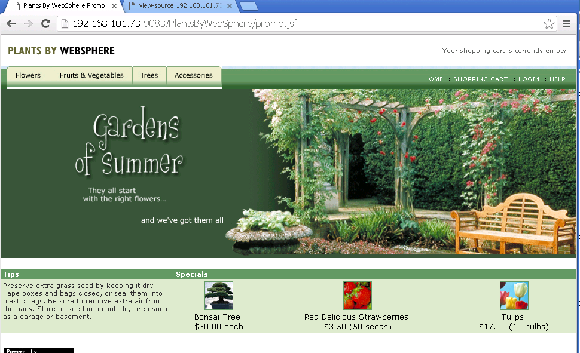

# IBM Client Developer Advocacy App Modernization Series

##  Plants by WebSphere Java EE 6  app for multiple labs in the App Modernization Series

This is a modified version of the code for the [Plants by WebSphere sample](https://www.ibm.com/support/knowledgecenter/en/SSAW57_8.5.5/com.ibm.websphere.nd.multiplatform.doc/ae/covr_samples.htmlgithub
  ) that comes with WebSphere Application Server V8.5.5 for use in IBM Cloud Private/IBM Cloud Kubernetes Service developer training. The code has been modified per the recommendations of the [IBM Cloud Transformation Advisor](https://www.ibm.com/support/knowledgecenter/en/SSBS6K_3.1.1/featured_applications/transformation_advisor.html).

This version of Plants By WebSphere is a small Java EE 6 app that uses a relational database to run a fictional eCommerce website called Plants By WebSphere.

## Required runtimes

**WebSphere Liberty Java application server:**  [WebSphere Liberty](https://developer.ibm.com/wasdev/websphere-liberty/) is a modular and easy-to-use Java application server, built on the open source [Open Liberty](https://openliberty.io/) project.

**Maria DB:** [Maria DB](https://mariadb.org) is a strictly open source  RDMS forked from  MySQL  by the original developers of MySQL.

## How it Works

The app consists  of a Java EE  web app for a fictional online plant store.  It supports user registration and purchases of various plants.  

  <kbd>
    
  </kbd>

